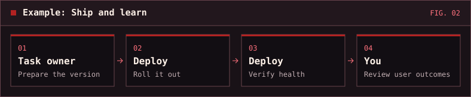

# Mirket


Mirket is a free collection of **16 reusable skills** for **Codex** and **Claude Code**. Plan, build and verify changes, assess security, migrate state, release and deploy, and operate the result.

Visit [skills.mirket.dev](https://skills.mirket.dev) for installation and workflow examples. Read the [repository documentation](docs/README.md) for the skills, philosophy, and plugin architecture.

## Install

**Codex**

```sh
codex plugin marketplace add https://github.com/nazmirket/skills.git
codex plugin add mirket@mirket
```

**Claude Code**

```sh
claude plugin marketplace add nazmirket/skills
claude plugin install mirket@mirket
```

Start a fresh session after installing. If your host asks you to trust hooks, review them first. See [hook requirements and behavior](CONTRIBUTING.md#lifecycle-hooks).

## Try it

Ask for the result you want, or name a skill:

- “Use Mirket Plan to outline this change and how we’ll verify it.”
- “Use Mirket Debug to reproduce this failure and find its cause.”
- “Use Mirket Audit to review this patch and report findings.”
- “Prepare this versioned artifact, then use Mirket Deploy to roll it out to staging.”
- “Use Mirket Deploy to check whether this service is healthy and its data is current.”

The [routing guide](references/Routing.md) helps you pick a workflow. You can also [browse all skills](skills/).

If you want Mirket to guide work by default, merge the [Codex instructions](instructions/AGENTS.md) into `~/.codex/AGENTS.md` or the [Claude Code instructions](instructions/CLAUDE.md) into `~/.claude/CLAUDE.md`.

## Mirket in practice




The task owner follows the [versioned distribution guide](references/VersionedDistribution.md) to prepare or publish an identified artifact. Deploy changes the target environment and owns service health, recovery, and freshness checks. Migrate owns persistent-state transitions, and Audit supplies security and privacy findings.

## License

[MIT](LICENSE). Anyone can use, modify, and redistribute Mirket, including commercially, as long as the license and copyright notices are retained.

[Contributing and testing](CONTRIBUTING.md)
